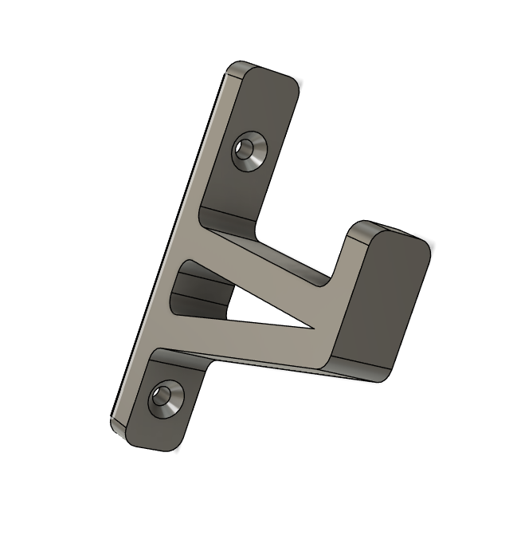
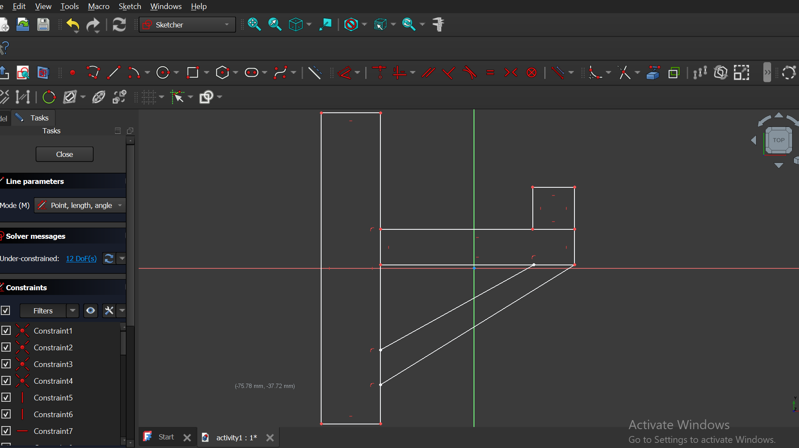
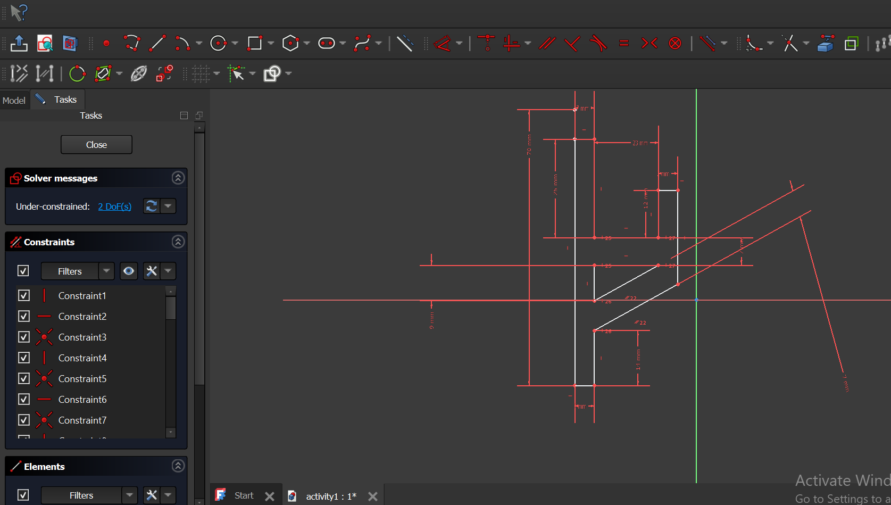
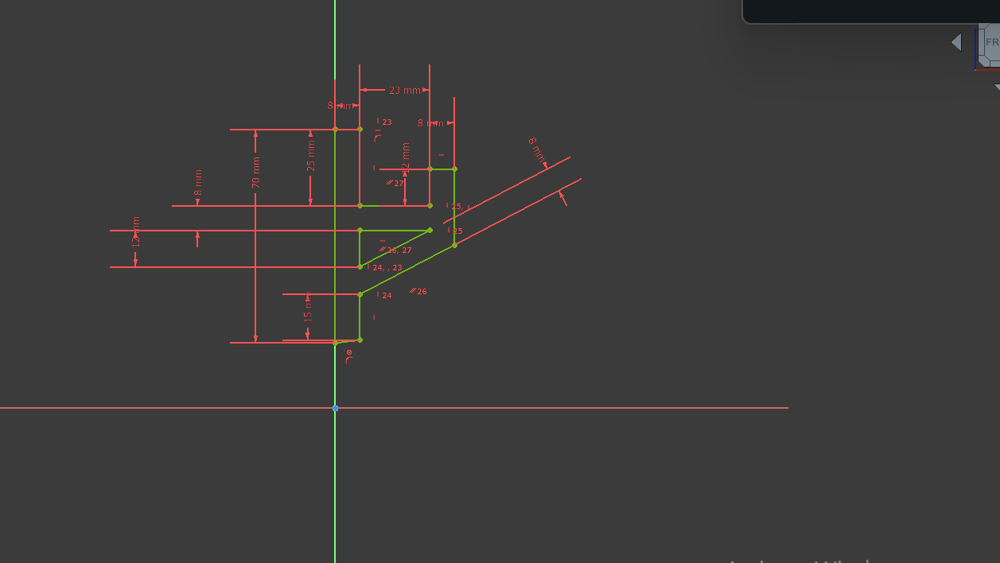
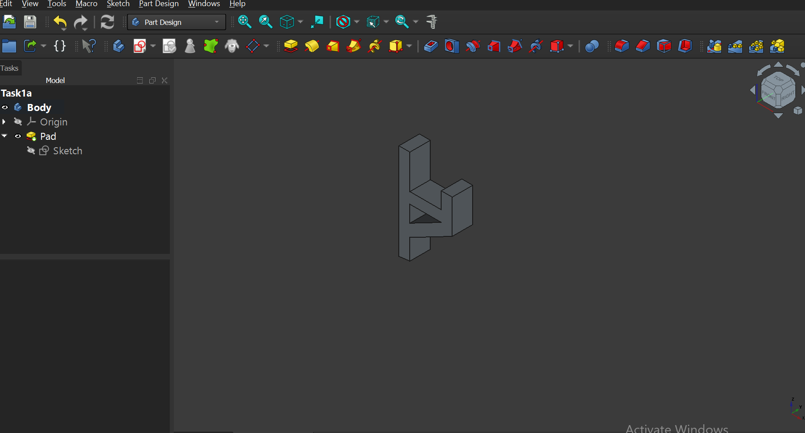
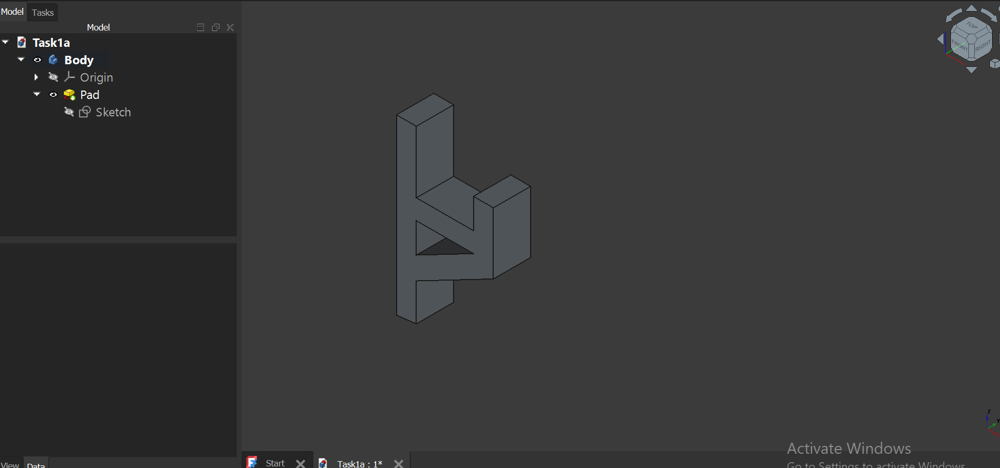
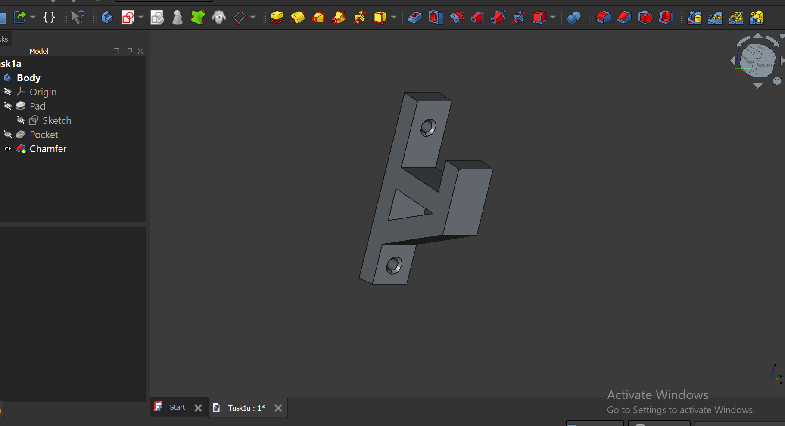
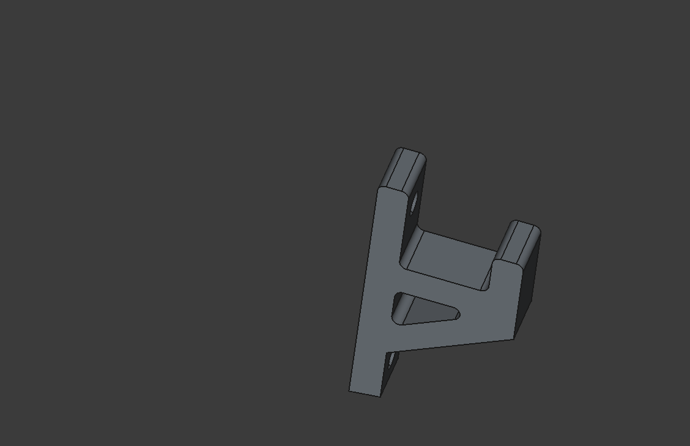
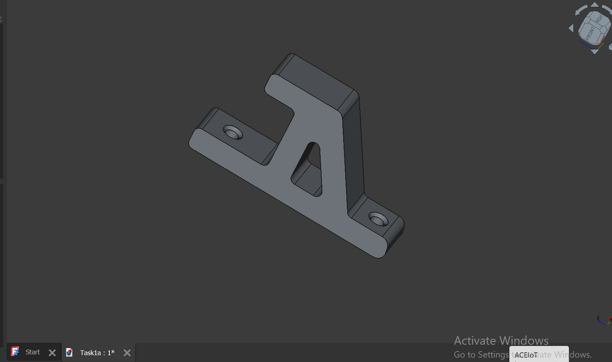

# 2. Day 2 – Digital Modeling for Fabrication

## Overview

Day 2 focused on digital modeling for fabrication, introducing both 3D parametric modeling and 2D vector design.
The goal was to understand how simple, fabrication-ready geometry is created using appropriate software tools.

Two modeling activities were completed:

    A 3D L-Shaped Mounting Bracket using FreeCAD

    A 2D Press-Fit Box Panel using Inkscape

## Activity 1 – FreeCAD Model  
### L-Shaped Mounting Bracket (3D)

!!! info "Design Goal"
    Create a simple **L-shaped mounting bracket** that demonstrates basic 3D modeling operations used in fabrication.

{ width=200 }

!!! info "Design Goal"
    Create a simple **L-shaped mounting bracket** that demonstrates basic 3D modeling operations used in fabrication.

### Design Characteristics
- Two flat faces at **90°**
- Two circular holes for screws or bolts
- Simple geometry with no complex curves
- One **filleted corner** for safety and manufacturability
---

## Implementation
### Modeling Workflow (FreeCAD)

## Modeling Workflow (FreeCAD)

The following steps describe the process used to model the **L-Shaped Mounting Bracket** in FreeCAD.

=== "Step 1 – Base Sketch"

!!! note
    - Created a new sketch on the reference plane  
    - Drew an **L-shaped 2D profile**  
    

---
=== "Step 2 - contrain"
- Applied dimensional constraints to fully define the sketch  

=== "Step 2 – Pad (Extrusion)"

!!! note
    - Used the **Pad** tool to extrude the sketch  
    - Defined thickness based on fabrication requirements  

---

=== "Step 3 – Holes"

!!! note
    - Created two circular holes using the **Hole** tool  
    - Positioned holes symmetrically  
    - Set diameters suitable for standard fasteners  

---

=== "Step 4 – Fillet"

!!! note
    - Applied a fillet to one corner  
    - Removed sharp edges to improve safety and manufacturability  

---

## Workflow Summary

!!! success
    The modeling process followed a structured sequence:
    
    1. Sketch – define geometry  
    2. Pad – create solid volume  
    3. Holes – enable mounting  
    4. Fillet – improve fabrication quality  

---

## Key Takeaway

A structured modeling workflow ensures that digital designs are **accurate, parametric, and ready for fabrication**.

* Download reference

Links to reference files, PDF, booklets,

