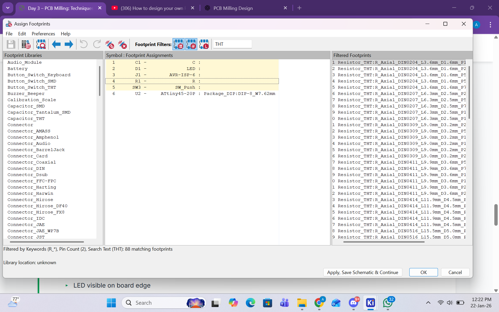
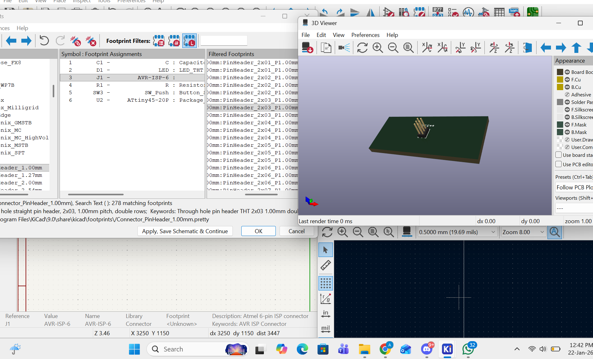
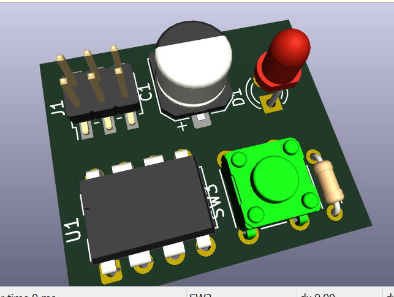
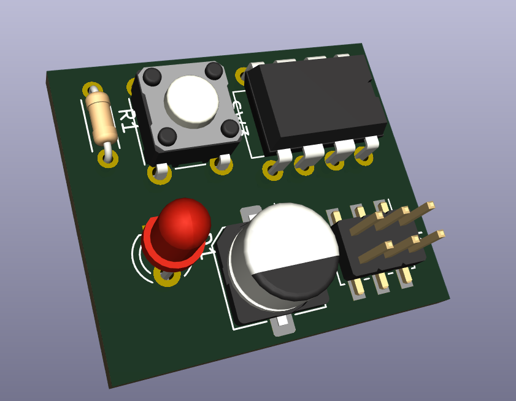
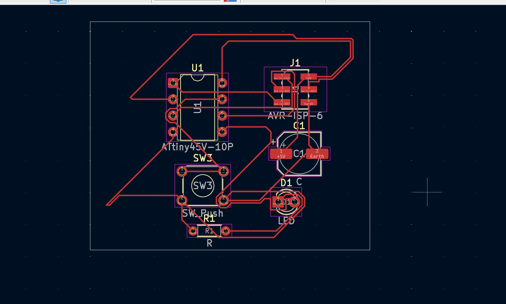
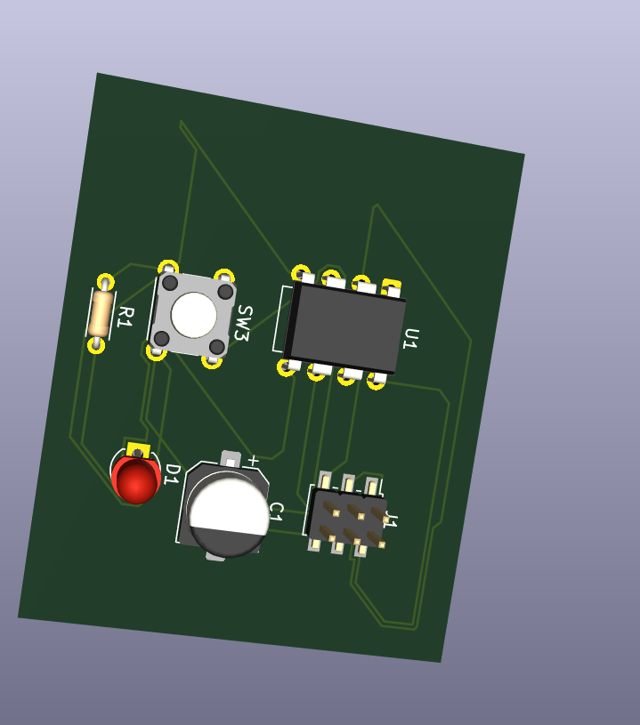

# 3. Activity of Day 3  
                          PCB Milling Techniques & Fabrication Process

## Overview

Day 3 focused on PCB design for fabrication, specifically creating a single-sided microcontroller PCB using KiCad.  
The objective was to understand the full workflow from schematic design to PCB layout and preparation for milling and soldering.

The board designed was a button-controlled LED circuit based on an **ATtiny45 microcontroller**, suitable for **ISP programming**.

## Block Diagram (Conceptual)

{ width=500 }

## Components Used

- ATtiny45 microcontroller  
- LED  
- Resistor  
- Push button  
- ISP header  
- Capacitors  
- Power source  

## Design Workflow (KiCad)

=== "Step 1 – Schematic Design"

    The schematic was created in KiCad by placing all components and connecting them correctly according to the circuit design.

    { width=500 }

---

=== "Step 2 – Assign Footprints"

    Each component in the schematic was assigned a suitable physical footprint to match the actual components used during fabrication.

    { width=300 }
    { width=300 }

---

=== "Step 3 – PCB Layout (Single-Sided)"

    - Converted the schematic to PCB layout  
    - Arranged components for a single-sided board  
    - Routed tracks manually to avoid overlaps  

    { width=300 }
    { width=300 }

---

=== "Step 4 – Design Rule Check (DFM)"

    - Checked clearance and trace width rules  
    - Ensured the design was suitable for PCB milling  
    - Verified there were no routing errors  

    { width=400 }

---

=== "Step 5 – Final Routed Board"

    The final routing was reviewed to confirm all connections were correct and ready for fabrication.

    { width=300 }
    { width=300 }

=== "Short reflection"

---

## Download Reference

[📄 Download Microcontroller PCB Design (KiCad Folder)](../downloads/Microcontroller_PCB_Design.zip){ .md-button .md-button--primary }
