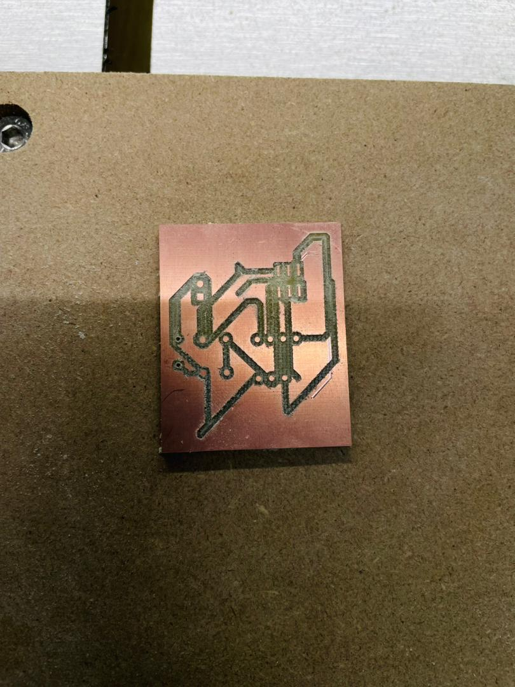

# 7. Activity of Day 7
            CNC Router Milling & Cutting

## Recap 

For this session, we built upon the work from **Day 3**, where we created the PCB design file in KiCad. This file included the schematic, component placement, and routed tracks, which were verified and prepared for fabrication. Today, we will use this same file as the basis for CNC milling, applying the concepts of toolpaths, tolerances, and material optimization.

## Actual Implementation – PCB Milling

After preparing the PCB design on Day 3, the actual fabrication process was carried out using a CNC router. The PCB design file was imported into **Cubide Motion**, which was used to control the CNC machine. Toolpaths for engraving the copper traces and cutting the PCB outline were generated, and appropriate parameters such as cutting depth, feed rate, and spindle speed were configured. A copper-clad board was secured firmly on the CNC bed, and the machine origin was set correctly before milling. The CNC router then engraved the traces and cut the board according to the generated toolpaths, resulting in a fabricated PCB ready for cleaning and component soldering.

