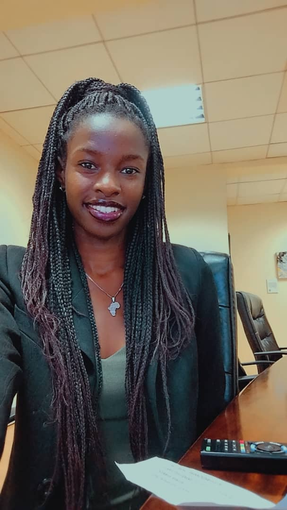

# My documentation

Welcome to my digital fabrication and modeling documentation website.  
This site documents my learning process, design decisions, and fabrication workflows throughout the course.

The documentation is built using **MkDocs with the Material theme** and version-controlled using **GitHub**, allowing changes to be tracked and published continuously.

## About me

{ width=200 align=right }

Hi! My name is **Andrinah Kaunda**.  
I am a technology enthusiast with a background in **Computer Science**.

I am passionate about combining **design, electronics, and fabrication** to build practical and innovative solutions.  
This website serves as a record of my learning journey, experiments, and reflections during the course.

## My background

I am originally from Malawi. 
i hold a Bachelor of Science Degree in Computer Science.
i am Current pursuing a Master of Science degree in Internet of Things: Embedded Computing Systems at the University of Rwanda , African Centre Of Excellence

<!-- This below clears both sides under "aligned" images - see two images above.
Can also be used just as "clear: right;" rather than "clear: both;", if you are using an image on the right, for example.
-->

  

